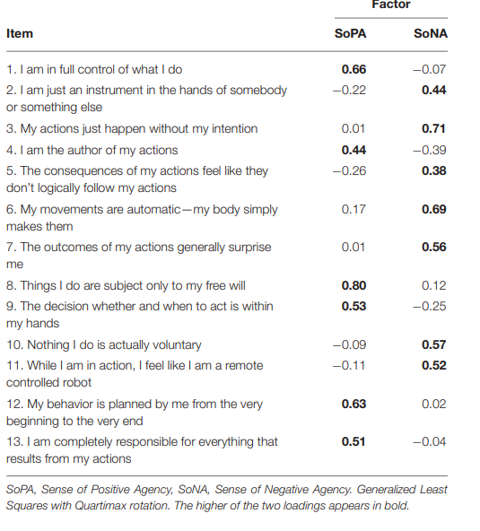
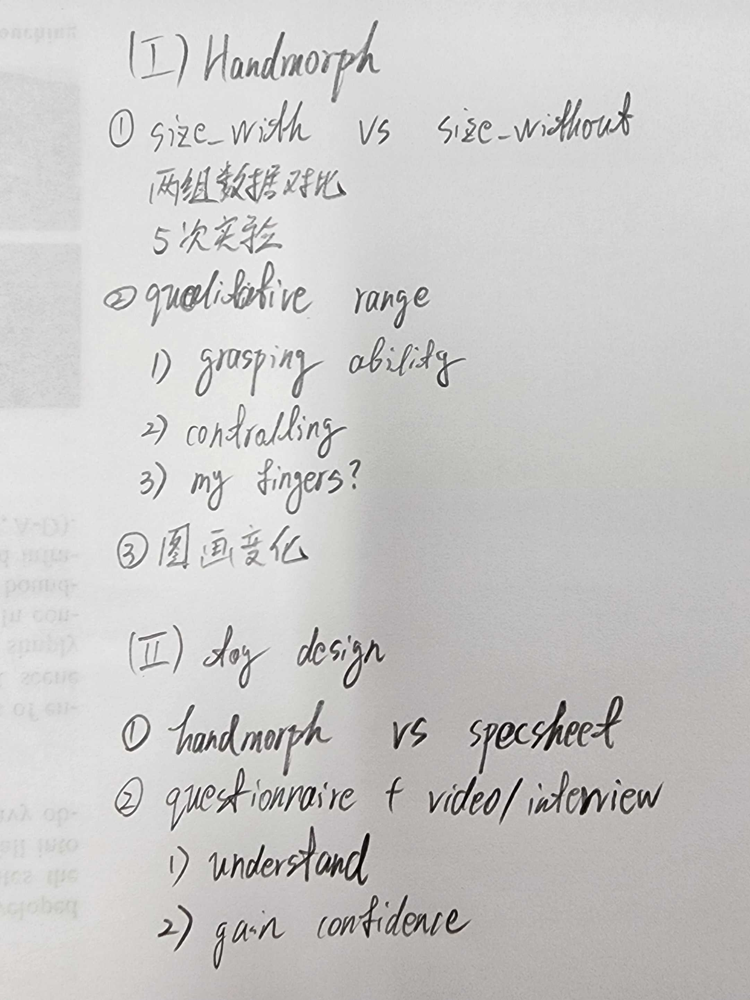

To Do List:  
check the past haptic research in KMD 
(gravity grabber) 
check the Patrick Baudisch 
check the Jan Gugenheimer 
zotero 

# List of reference

## **000 Name**
T  I  T  L  E

`Focus on which mechanics effect` --- `Haptic solution`

>research objective and scenarios

### Limitation :
1. 
2. 
3. 

### Future Work :
1. 
2. 
3. 

 

## **001 VR Catch Ball**
A novel interaction system with force feedback between real - and virtual human an entertainment system virtual catch ball

`touch and force-feedback activities` --- `Game System'VR Catch Ball'`

>human-scale virtual environment

### Limitation :
1. a single point of contact 
2. add more physical phenomena
3. a balance between real-time motion synthesis and realistic human motions

### Future Work :
1. a multi-modal interaction system that involves gaze and tactile sensation
2. a touchable virtual human

 

## **002 Wearable Robots**
Wearable Robots An Original Mechatronic Design of a Hand Exoskeleton for Assistive and Rehabilitative Purposes

`mechatronic design` --- `hand exoskeleton`

>assistive and rehabilitative purposes

### Limitation :
1. overall dimensions
2. actuation needs to be replaced
3. lack of a thumb-handling mechanism

### Future Work :
1. the development of a thumb actuation
2. independent finger movement
3. component miniaturization

 

## **003 Wireality**
Wireality: Enabling Complex Tangible Geometries in Virtual Reality with Worn Multi-String Haptics 

`Complex tangible geometries` --- `worn multi-string haptics`

>Low-cast low-power

### Limitation :
1. only resistive force in perpendicular to the wearer’s body
2. simulation failure after touching a surface or object
3. cannot explore complex geometries in a continuous forward motion
4. inability to simulate the small objects and handheld objects

### Future Work :
1. haptic retargeting
2. can be combined with other haptic systems and feedback types

 

## **004 DexController**
DexController : Designing a VR Controller with Grasp-Recognition for Enriching Natural Game Experience

`grasp recognition` --- `sensors`

>natual game experience

### Limitation :
1. a single variable of grasp modality was too simple
2. limited scope in a case of VR game context

### Future Work :
1. grasp force into five intervals or a continuous value

 

## **005 ElasticVR**
ElasticVR: Providing Multilevel Continuously-Changing Resistive Force and Instant Impact Using Elasticity for VR

`multilevel continuously-changing resistive force and instant impact` --- `elastic band`

> VR, length and extension distance

### Limitation :
1. cannot provide resistive force to arm
2. need to store power for impact

### Future Work :
1. provide the force to fingers
2. using advanced brakes

 

## **006 ElastOscillation**
Demonstration of ElastOscillation: A VR Controller Providing 3D Multilevel Feedback for Damped Oscillation

`damped oscillation feedback` --- `six elastic bands and DC motors`

>VR app, pan-flipping, bartender-shaking, wine-swiring and fishing

 

## **007 JetController**
JetController: High-speed Ungrounded 3-DoF Force Feedback Controllers using Air Propulsion Jets

`3-DoF force feedback` --- `air propulsion jets`

>high frequency, support popular game

 

## **008 AirRacket**
AirRacket: Perceptual Design of Ungrounded, Directional Force Feedback to Improve Virtual Racket Sports Experiences

`ungrounded, directional force feedback` --- `air propulsion jet` 

>Virtual Racket sports experience

 

## **009 ELAXO**
ELAXO : Rendering Versatile Resistive Force Feedback for Fingers Grasping and Twisting

`versatile resistive force feedback` --- `exoskeleton with rings mechanical brakes and elastic bands`

>fingers grasping and twisting

 

## **010 SPIDAR-W**
ウェアラブル 6 自由度力覚提示デバイス

 

## **011 SPIDAR-WⅡ**
ウェアラブル 6 自由度力覚提示デバイス SPIDAR-W の フレームの軽量化とエンドエフェクタの改良

 

## **012 Shape Illusion**
Computational design of hand-held VR controllers using haptic shape illusion

`contradiction between haptic and visual` --- `haptic shape illusion`

>design shape maintain same haptic shape perception

 

## **013 Transcalibur**
Transcalibur: A Weight Shifting Virtual Reality Controller for 2D Shape Rendering based on Computational Perception Model

`VR controller cannot render shape` --- `a weight shifting`

>2D shape rendering

 

## **014 PaCaPa**
PaCaPa: A Handheld VR Device for Rendering Size, Shape, and Stiffness of Virtual Objects in Tool-based Interactions

`rendering size shape stiffness` --- `tool-based interactions`

>render the collision

 

## **015 BLASTNEL**
BLASTNEL: Collision Sensation Display for Virtual Reality Games Using Highly Compressed Air

`collision sensation display` --- `highly compressed air`

>VR game

 

## **016 Unident**
Unident: Providing Impact Sensations on Handheld Objects via High-Speed Change of the Rotational Inertia

`rotational inertia` --- `moving its weight along one axis`

>improving the impact sensations

 

## **017 MetamorphX**
MetamorphX: An Ungrounded 3-DoF Moment Display that Changes its Physical Properties through Rotational Impedance Control

`rotational impedance` --- `control moment gyroscopes (CMGs)`

> physical properties (inertia and viscosity)

 

## **018 Tactile Compass**
Tactile Compass: Enabling Visually Impaired People to Follow a
Path with Continuous Directional Feedback

`Focus on which mechanics effect` --- `Haptic solution`

 

## **019 inFORCE**
inFORCE:Bi-directional ‘Force’ Shape Display For Haptic Interaction

`Focus on which mechanics effect` --- `Haptic solution`

 

## **020 TouchBall**
“TouchBall”: A Design and Evaluation of a Hand-held Trackball based Touch-Haptic Interface 

`Focus on which mechanics effect` --- `Haptic solution`

 

## **021 HapBelt**
HapBelt: Haptic Display for Presenting Vibrotactile and Force Sense Using Belt-winding Mechanism

`Focus on which mechanics effect` --- `Haptic solution`

 

## **022 DualVib**
DualVib: Simulating Haptic Sensation of Dynamic Mass by Combining Pseudo-Force and Texture Feedback

`Focus on which mechanics effect` --- `Haptic solution`

 

## **000 TBD**

 
 
 

# EMS haptic device
## **001 Impacto**
Impacto: Simulating Physical Impact by Combining Tactile Stimulation with Electrical Muscle Stimulation

`physical impact` --- `solenoid,electrodes,EMS`

>VR sport simulators

 

## **002 Affordance++**
Affordance++: Allowing Objects to Communicate Dynamic Use

`dynamic use` --- `EMS`

>"suggest how to be used"

 

## **003 Walls & Heavy Objects**
Providing Haptics to Walls & Heavy Objects in Virtual Reality by Means of Electrical Muscle Stimulation

`resistance` --- `EMS`

>walls & heavy objects

 

## **004 MR**
Adding Force Feedback to Mixed Reality Experiences and Games using Electrical Muscle Stimulation

`force feedback` --- `EMS`

>MR experiences

 
 
 

# Microsoft Research - Haptic Controllers & Rich Haptics for MR
## **001 Haptic Revolver**
Haptic Revolver: Touch, Shear, Texture, and Shape Rendering on a Reconfigurable Virtual Reality Controller

`shear force and motion` --- `spin the wheel`

>surface features and techniques

 

## **002 CapstanCrunch**
CapstanCrunch: A Haptic VR Controller with User-supplied Force Feedback

`variable stiffness and compliance` --- `friction-based capstan brake mechanism`

>touch and grasp haptic sensations

 

## **003 Haptic PIVOT**
Haptic PIVOT: On-Demand Handhelds in VR

`force actiong on the held virtual objects` --- `on-demand generic haptic handle`

>rendering grasping catching and throwing hand held objects

 

## **004 TORC**
TORC: A virtual reality controller for in-hand high-dexterity finger interaction

`high-dexterity finger interaction` --- `vibrotactile motors`

>render virtual object characteristics and behaviors

 

## **005 X-Rings**
X-Rings: A Hand-mounted 360° Shape Display for Grasping in Virtual Reality

`360° shape display` --- `motor gear and wedge`

>virtual objects 

 

## **000 TBD**

# Survey

## **001 Can I Touch This ?**
"Can I Touch This?": Survey of Virtual Reality Interactions via Haptic Solutions

dimention: physically and actuation 
criteria: User experience and conception cost

 

## **002 Let's Meet and Work it Out**
"Let’s Meet and Work it Out": Understanding and Mitigating Encountered-Type of Haptic Devices Failure Modes in VR

ETHD - Encountered-Type of Haptic Device 
FMEA - Failure modes and effects analysis

steps: Intention - Displacement & Reconfiguration - Interaction

 

## **003 Survey of Pseudo-Haptics**
Survey of Pseudo-Haptics: Haptic Feedback Design and Application Proposals

physical stimuli - mechanical haptic interfaces 
Pseudo-Haptics - illusional haptic perceptions

object properties: material, geometric 
user input: displacement, force, pressing duration 
visual stimuli: displacement, surface deformation, color, size

 

## **004 Quality of Experience**
A survey of challenges and methods for Quality of Experience
assessment of interactive VR applications

Quality of Experience
7 questions- stakeholders,influence factors,prescreening,test material,QoE methodology,temporal aspect, environment

 

## **005 Survey for Weight Perception**
A Survey on Simulation for Weight Perception in Virtual Reality

1.no unitied simulation method 
2.inconsistency of vistual feedback and real hand motion

 

## **006 Pseudo-Haptic Feedback**
Simulating Haptic Feedback Using Vision: a Survey of Research and Applications of “Pseudo-Haptic Feedback”

visuo-haptic integration & haptic illusions 
haptic properties: friction,stiffness,mass,texture

 
 
 

# Self-motion
## **001 Haptic Motion**
Haptic Motion: Improving Sensation of Self-Motion in Virtual Worlds with
Force Feedback

`self-motion system` --- `grounded 6dof device`

>2 experiments, control vestibular influences and semicircular canal 
>1. Can force-feedback increase the illusion of self motion?
>2. Generalization of the Concept in Full 3D Context, more
complex trajectory and 5 haptic patterns

Result:
1. haptic induces frequency and visual induces duration
2. weak with speed and no correlation with direction

 

## **002 Haptic Feedback Improve**
Can Haptic Feedback Improve the Perception of Self-Motion in Virtual Reality? 

• Can haptic feedback substitute for the missing 
sensations of navigation in VR (i.e. proprioceptive and 
vestibular information)? 

• Can haptic feedback improve the perception of selfmotion,
 the memorization of a trajectory, and the 
creation of cognitive maps?

>experiment
>exploration: watched a passive visual navigation 
>reproduction: asked to estimate the angle of the visual 
turn

Result:
the range effect  
asymmetrical effect  
complex trajectories  
other haptic feedback  

## **003 Active Haptic Perception in Robots: A Review**

 
 
 

# Design of experiments
## **001 The Sense of Agency Scale**
The Sense of Agency Scale: A Measure of Consciously Perceived Control over One’s Mind, Body, and the Immediate Environment
>

## **002 HandMorph**
HandMorph: a Passive Exoskeleton that Miniaturizes Grasp

`change the size perception` --- `passive expskeleton`

>2 experiments  
>1. size perception experiment
>2. simple toy design session
>3. user test without instructions
>
>

## **003 Game Experience Questionnaire 1**
The Game Experience Questionnaire. Technische Universiteit Eindhoven.

## **004 Game Experience Questionnaire 2**
Game Experience Questionnaire: development of a self-report measure to assess the psychological impact of digital games. Technische Universiteit Eindhoven.

## **005 PXI_Questionnaire**
Development and validation of the player experience inventory: A scale to measure player experiences at the level of functional and psychosocial consequences

## **006 NASA Task Load Index**
Development of NASA-TLX (Task Load Index): Results of Empirical and Theoretical Research

 
 
 
